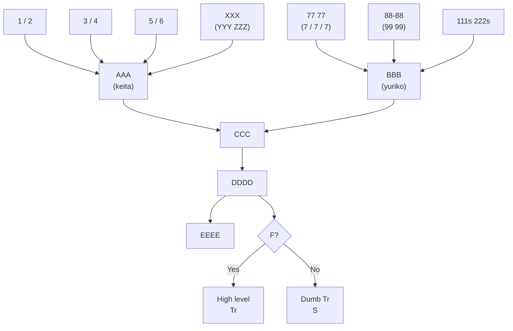

```mermaid
  graph TD
      A["AAA<br>(keita)"] --> C["CCC"]
      B["BBB<br>(yuriko)"] --> C
      C --> D["DDDD"]
      D --> E["EEEE"]

      A1["1 / 2"] --> A
      A2["3 / 4"] --> A
      A3["5 / 6"] --> A
      A4["XXX<br>(YYY ZZZ)"] --> A

      B1["77 77<br>(7 / 7 / 7)"] --> B
      B2["88-88<br>(99 99)"] --> B
      B3["111s 222s"] --> B

      D --> F{"F?"}
      F -->|Yes| G["High level<br>Tr"]
      F -->|No| H["Dumb Tr<br>S"]
```
