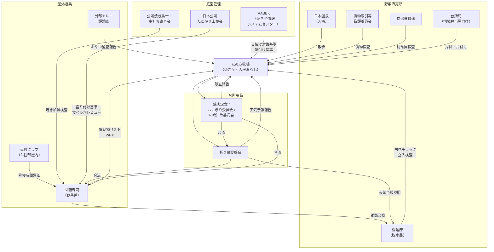

```mermaid
graph TB
    PQ["たぬき牧場<br>（焼き芋・大根おろし）"]

    subgraph 台所用品
        XK["折り紙愛好会"]
        MW["焼肉定食 /<br>おにぎり委員会 /<br>味噌汁等委員会"]
    end

    subgraph 屋外遊具
        RJ["回転寿司<br>（お茶係）"]
        GBN["昼寝クラブ<br>（布団部屋内）"]
        VD["外部カレー<br>評論家"]
    end

    subgraph 野菜直売所
        HNT["洗濯庁<br>（脱水局）"]
        KWRP["漬物取引等<br>品評委員会"]
        ZMC["日本温泉<br>（入浴）"]
        FTGL["枕保管機構"]
        YSR["台所局<br>（地域弁当屋向け）"]
    end

    subgraph 庭園管理
        RTTQM["公認焼き鳥士・<br>串打ち審査会"]
        AABBK["AABBK<br>（焼き芋情報<br>システムセンター）"]
        BVHNE["日本公認<br>たこ焼き士協会"]
    end

    PQ --> XK
    PQ --> MW
    XK -->|天気予報報告| PQ
    MW -->|献立報告| PQ

    RJ -->|買い物リスト<br>WPX| PQ
    GBN -->|昼寝時間評価| RJ
    VD -->|おやつ監査報告| PQ

    HNT -->|味見チェック<br>立入検査| PQ
    ZMC -->|散歩| PQ
    KWRP -->|漬物検査| PQ
    FTGL -->|枕品質検査| PQ
    YSR -->|掃除・片付け| PQ

    RTTQM -->|焼き加減検査| RJ
    AABBK -->|日焼け対策基準<br>味付け基準| PQ
    BVHNE -->|盛り付け基準<br>食べ歩きレビュー| RJ

    RJ -->|雑談交換| HNT
    XK -->|天気予報参照| HNT
    XK -->|合流| RJ
    MW -->|合流| RJ
    MW -->|合流| XK
```
