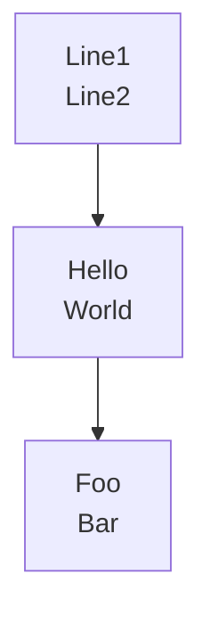

# BR Tag Test

Testing ` ` tag support in mermaid diagrams:

```mermaid
flowchart TD
    A[Line1<br>Line2] --> B[Hello<br/>World]
    B --> C[Foo<br />Bar]
```

All three variants should render as line breaks.
