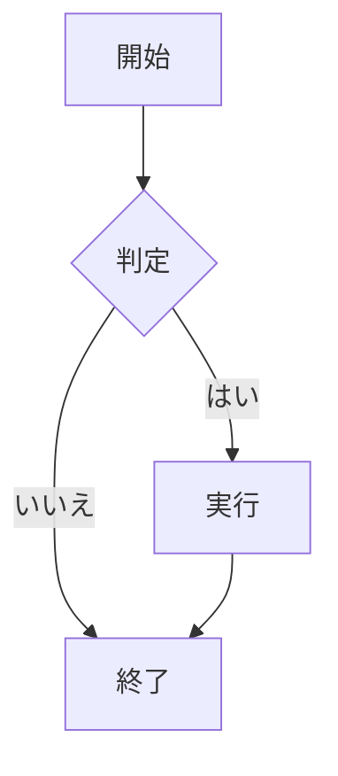

# CJK Test

Testing Japanese text in mermaid diagrams:

```mermaid
flowchart TD
    A[開始] --> B{判定}
    B -->|はい| C[実行]
    B -->|いいえ| D[終了]
    C --> D
```

Japanese labels should render correctly.
