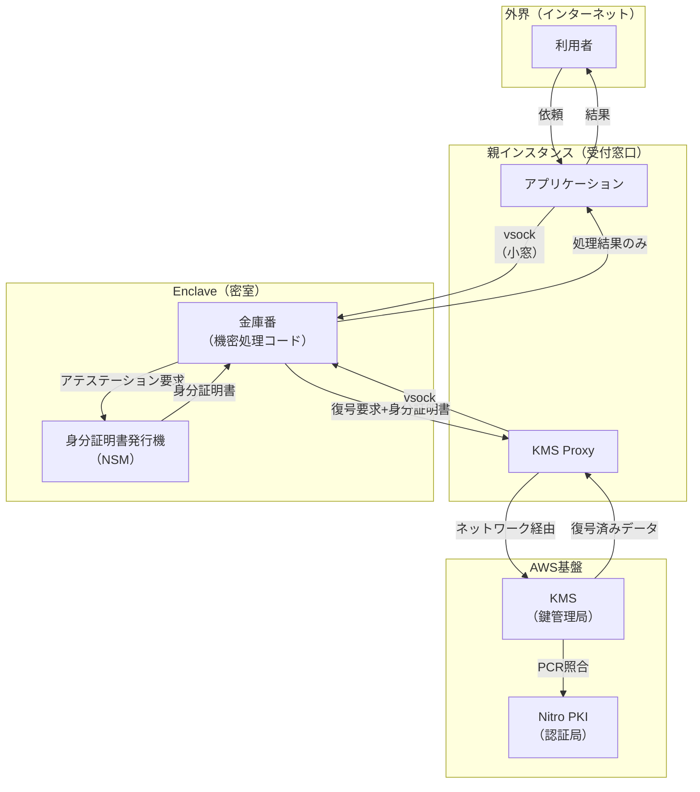

```mermaid
graph TD
    subgraph 外界["外界（インターネット）"]
        User["利用者"]
    end

    subgraph Parent["親インスタンス（受付窓口）"]
        App["アプリケーション"]
        Proxy["KMS Proxy"]
    end

    subgraph Enclave["Enclave（密室）"]
        Worker["金庫番<br>（機密処理コード）"]
        NSM["身分証明書発行機<br>（NSM）"]
    end

    subgraph AWS["AWS基盤"]
        KMS["KMS<br>（鍵管理局）"]
        PKI["Nitro PKI<br>（認証局）"]
    end

    User -->|"依頼"| App
    App -->|"vsock<br>（小窓）"| Worker
    Worker -->|"アテステーション要求"| NSM
    NSM -->|"身分証明書"| Worker
    Worker -->|"復号要求+身分証明書"| Proxy
    Proxy -->|"ネットワーク経由"| KMS
    KMS -->|"PCR照合"| PKI
    KMS -->|"復号済みデータ"| Proxy
    Proxy -->|"vsock"| Worker
    Worker -->|"処理結果のみ"| App
    App -->|"結果"| User
```
