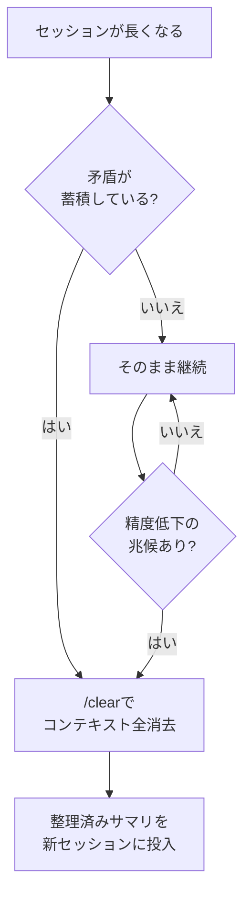

# Cycle Diagram Test

```mermaid
graph TD
    A["セッションが長くなる"] --> B{"矛盾が<br>蓄積している?"}
    B -- はい --> C["/clearで<br>コンテキスト全消去"]
    C --> D["整理済みサマリを<br>新セッションに投入"]
    B -- いいえ --> E["そのまま継続"]
    E --> F{"精度低下の<br>兆候あり?"}
    F -- はい --> C
    F -- いいえ --> E
```
